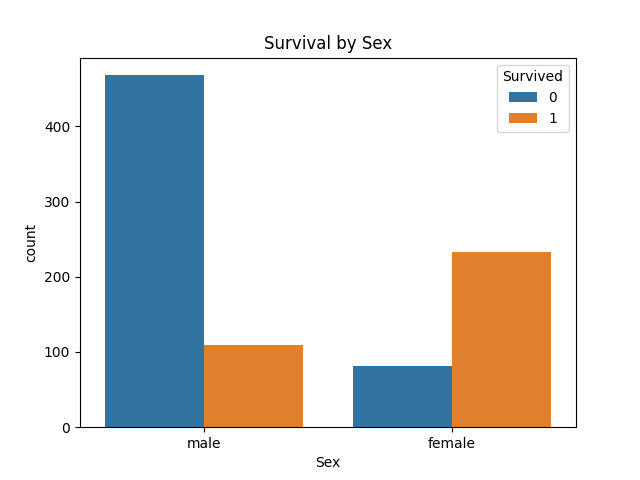

# TITANIC DATASET: EXPLORATORY DATA ANALYSIS
This repository showcases my work on the Titanic dataset as part of my internship at Prodigy Infotech. The goal of this task was to perform data cleaning, exploratory data analysis (EDA), and identify patterns and relationships in the data that influenced passenger survival.

# OBJECTIVE
To analyze the Titanic dataset and:

1. Perform data cleaning to handle missing or inconsistent data.
2. Conduct EDA to explore survival rates and patterns.
3. Visualize relationships between variables like gender, passenger class, age group, and family size.

# DATA CLEANING
Before analysis, the dataset was cleaned to ensure accuracy. Key steps included:

a. Identifying and handling missing values in the Age and Embarked columns.
b. Dropping columns like Name and Cabin, which were not relevant to the task.

a. OBSERVATION: Women had a much higher survival rate (74.2%) compared to men (18.9%).

b. INSIGHT: This aligns with the " Women and Children first" evacuation policy.

# KEY INSIGHTS AND VISUALIZATIONS

1. Survival Rates by Age Group
   

a. OBSERVATION: Children under 16 had the highest survival rate compared to other age groups

b. INSIGHT: Younger passengers likely recieved priority during evacuation.

2. Survival Rates by passenger class

a. OBSERVATION: 1st-class passengers had the highest survival rate (62.9%), while 3rd class had the lowest (24.2%).

b. INSIGHT: Socio-economic factors played a significant role in survival.

3. Survival Rate by Family Size
   

OBSERVATION: Passengers with small families (1-3 members) had the highest survival rates.

INSIGHT: Larger families may have struggles to stay together during evacuation.

4. Survival Rate by Port of Embarkation

a. OBSERVATION: Passengers boarding at Cherbourg had the highest survival rates.

5. Correlation Heatmap

a. OBSERVATION: Strong Correlation observed between survival and features like Fare and Pclass.

# TOOLS AND LIBRARIES USED

a. Programming Language: Python
b. Libraries: Pandas, Matplotlib,Seaborn

# NEXT STEPS

a. Further analysis by incorporating additional variables like Ticket Prefix and Deck.
b. Develop predictive models based on these insights.

